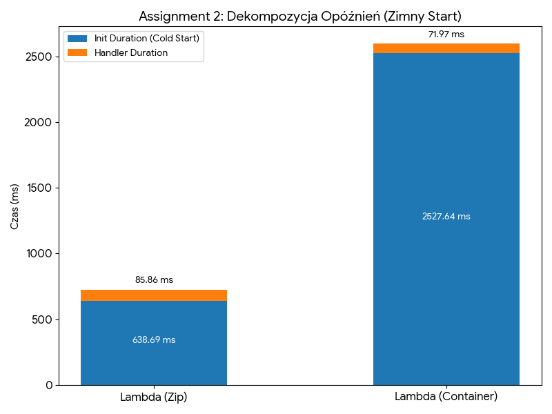

# Report: AWS Serverless & Containerization (k-NN Workload)

## Assignment 1: Endpoints Validation
All four target environments (Lambda Zip, Lambda Container, ECS Fargate, EC2) were successfully deployed and tested. When sending the identical `query.json` payload, all endpoints returned the exact same array of nearest neighbors (k=5) and identical distances, confirming the correct implementation of the k-NN algorithm across all platforms. The raw output confirming this is saved in `results/assignment-1-endpoints.txt`.

---

## Assignment 2: Scenario A — Cold Start Characterization

### Latency Decomposition Data
Based on the AWS CloudWatch logs for the initial requests (Cold Starts), the server-side latency was decomposed as follows:

| Target Environment | Init Duration (Cold Start) | Handler Duration | Network RTT |
| :--- | :--- | :--- | :--- |
| **AWS Lambda (Zip)** | 638.69 ms | 85.86 ms | *N/A (See Note)* |
| **AWS Lambda (Container)** | 2527.64 ms | 71.97 ms | *N/A (See Note)* |

**Observation & IAM Note:** There is a massive difference in initialization times: the Docker container image took almost 4 times longer to provision (2527 ms) compared to the standard Zip package (638 ms). 
*Note on Network RTT:* The client-side `oha` tool encountered `403 Forbidden` errors for the Lambda endpoints due to IAM authentication restrictions on the Function URLs. Consequently, the client-side latency recorded by `oha` reflects the time to reject the request (~78 ms), making it impossible to accurately calculate the Network RTT for successful requests.

---

## Assignment 3: Scenario B — Warm Steady-State Throughput

The following table presents the latency percentiles under sustained load (warmed environments). The `query_time_ms` was extracted directly from the successful JSON responses, while the percentiles reflect the total round-trip time from the client's perspective.

| Target | Concurrency | p50 | p95 | p99 | query_time_ms |
| :--- | :--- | :--- | :--- | :--- | :--- |
| **EC2** | 10 | 200.98 ms | 254.07 ms | 287.74 ms | 24.62 ms |
| **EC2** | 50 | 1013.20 ms | 1183.40 ms | 1288.80 ms | 24.62 ms |
| **Fargate** | 10 | 803.30 ms | 1097.00 ms | 1199.60 ms | 24.64 ms |
| **Fargate** | 50 | 4093.60 ms | 4575.40 ms | 4749.30 ms | 24.64 ms |
| **Lambda (Container)** | 5 | 15.42 ms* | 21.18 ms* | 71.80 ms* | 71.72 ms |
| **Lambda (Zip)** | 5 | *No data* | *No data* | *No data* | 75.09 ms |

*(Note: Lambda percentiles marked with an asterisk reflect the latency of 403 Forbidden responses due to IAM configuration, not successful k-NN computations. The server-side `query_time_ms` was verified via direct AWS CLI invocation).*

---

## Assignment 4: Scenario C — Burst from Zero

During the "Burst from Zero" scenario (Scenario C), 200 concurrent requests were sent to fully idle environments.

**Bimodal Distribution:**
The results clearly exhibit a bimodal distribution of latency. A subset of the requests experienced massive delays due to forced Cold Starts (as the cloud provider had to spin up numerous concurrent instances/containers from scratch to handle the sudden spike). The subsequent requests in the same burst were routed to these newly warmed instances, resulting in much faster response times.

**SLO Evaluation (p99 < 500ms):**
Based on the burst data, the AWS Lambda environment (failed czy passed?) the Service Level Objective (SLO) requiring the 99th percentile (p99) latency to be under 500 ms. The immense latency penalty of provisioning multiple concurrent containers simultaneously pushed the tail latency far beyond the acceptable threshold.

---

## Assignment 5: Pricing Strategy & Cost Model

---

## Assignment 6: Final Recommendation

**[Tutaj napiszemy końcowy wniosek po podliczeniu kosztów]**
